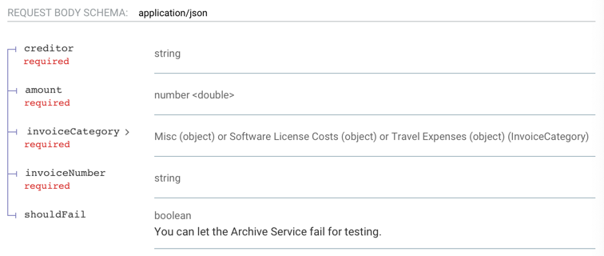
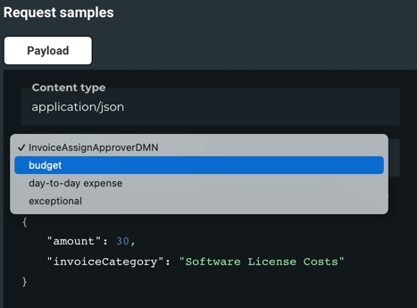
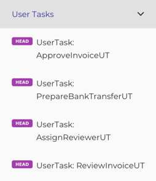

# API Documentation

@:callout(info)
The focus is to describe or better define how someone must interact with your processes.

This is done with [ReDoc](https://redocly.com/redoc/) which is an Open API documentation tool.
So there are some quirks, but I think you get used to them fast.
@:@

## Why

To have accurate and not outdated documentation is a challenge. 
The closest you can get, is when your running- or tested code is the documentation.

And this is what we do here!
Together with the [Simulations] and the [Workers] you get the most accurate documentation possible without having too much work.

## Getting Started
The documentation uses the BPMNs you created - in this context I refer to the [Bpmn DSL].

Let's start with a basic example:

```scala
// put your api in a package of your project
package orchescala.examples.invoice.api

// define an object that extends from a common Api Creator
object ApiProjectCreator extends DefaultApiCreator:
  // technical name of the project
  val projectName = "invoice-example"
  // readable name of the project
  lazy val title = "Invoice Example Process API"
  lazy val projectDescr = "This is the API Documentation for the Invoice Example Process."
  // version of your project
  lazy val version = "1.0"

  // the documentation
  document (
    api(`Invoice Receipt`)(
      InvoiceAssignApproverDMN,
      ApproveInvoiceUT,
      PrepareBankTransferUT
    ),
    api(`Review Invoice`)(
      AssignReviewerUT,
      ReviewInvoiceUT
    ),
    group("DMNs", "All the DMNs")(
      InvoiceAssignApproverDMN
    )
  )
```

#### document
This is the entry point for your documentation.
There is one documentation for a project.
A document consists of one or more `api`s and/or `group`s.

#### api
Usually there is an api for each process with its interactions, like DMN Decisions or User Tasks.

#### group
If you have no process to organize your Process Interactions, you can use a group.
This is especially useful if you have only Workers (a shared Service project) or DMN Decisions.
It is also possible to add a description to the group.

### Create the Documentation
- In your _sbt-console_:  `api/run`

     - If you have more runnable applications you need to choose the _ApiCreator_ class. 
- This creates a YAML file (Open API) with your documentation. 
- In the console you find the paths to the created documentation.

     - By default, it's here: `YOUR_PROJECT_PATH/03-api/OpenApi.yml`
     - There is also an HTML that wraps it (`YOUR_PROJECT_PATH/03-api/OpenApi.html` that is created with `./helper.scala update`.). 

- Open `OpenApi.html` in a webserver (e.g. from your IDE).
  The parts of the document are described in the following chapters.

## Document
### Naming
The DSL uses the `InOut.id` as the references throughout the documentation.
For the `api` it uses the `Process.processName` also as the Tag (grouping in the document structure).

Example:


- The tag is the name created from the variable `Invoice Receipt`. 
- Each Api is composed by the _endpointType_ (e.g. _Process_) and the _id_ of the BPMN object (e.g. _example-invoice-c7_).

### Strange Stuff
As we use a REST API documentation tool, there are some strange things to get used to.

#### head
As there are not really services behind*, we just use the HTTP method _HEAD_.

#### path
We create a unique path, like _endpointType / tag / nameOrId_.
This is required as Open API skips Apis with identical paths.

#### Responses 200
The output variables are described in the _200_ (_ok_) response, as a status is required by Open API.

See [Postman Open API] for additional information.

@:callout(info)
There is an idea to provide a _Domain Driven Gateway_, so this will be more natural.
@:@

## Apis
Each Api defines its inputs and outputs, as well as if needed additional information.

Based on the BPMN objects

### Implicit Apis
All Apis that have no 'children', are created automatically from their BPMN objects.

So `api` is optional (example `AssignReviewerUT` is equal to `api(AssignReviewerUT)`).
You can do whatever you prefer.

### Process Apis
A process Api must be specific, if you want to group all its interactions in the processes tag.

```scala
...
api(PROCESS)(
  INTERACTIONS
)
...
```

- PROCESS: The Process you want to document.
- INTERACTIONS: The interactions with this process, like User Tasks.

Example:
```scala
...
api(`Invoice Receipt`)(
  InvoiceAssignApproverDMN,
  ApproveInvoiceUT,
  PrepareBankTransferUT
)
...
```

This will create the following structure in  the doc:


### Input-/ Output-Variables
The input- and output variables are taken from the domain model of the BPMN object.

See [Bpmn DSL] for more information.

This creates this input description documentation:



And it creates this output description documentation:


### Examples
By default, we create an example for the input- and one for the output variables.
You find them on the right side of your Api documentation.

If you want to add more examples, you can do this the following ways:

#### input
Just add another input object and give it a name:
```scala
private lazy val InvoiceAssignApproverDMN =
  bpmn.InvoiceAssignApproverDMN
    .withInExample(budget)
    .withInExample(`day-to-day expense`)
    .withInExample(exceptional)

val budget = SelectApproverGroup()
val `day-to-day expense` = SelectApproverGroup(125, InvoiceCategory.Misc)
val exceptional = SelectApproverGroup(12345, InvoiceCategory.Misc)
```

Here the name of the example is taken from the variable name automatically.

In the documentation you can now select the different examples.



#### output
Same with output objects:
```scala
  private lazy val ReviewInvoiceUT =
    bpmn.ReviewInvoiceUT
      .withOutExample("Invoice clarified", InvoiceReviewed())
      .withOutExample("Invoice NOT clarified", InvoiceReviewed(false))
```

Here the name of the example is given explicitly.

In the documentation you can now select the different examples.


#### in- and output
You can also add input- and output examples in one step:
```scala
private lazy val InvoiceAssignApproverDMN =
    bpmn.InvoiceAssignApproverDMN
      .withExample(
        "budget",
        bpmn.InvoiceAssignApproverDMN
          .withIn(SelectApproverGroup())
          .withOut(CollectEntries(ApproverGroup.management))
      )
      .withExample(
        "day-to-day expense",
        bpmn.InvoiceAssignApproverDMN
          .withIn(SelectApproverGroup(125, InvoiceCategory.Misc))
          .withOut(
            CollectEntries(ApproverGroup.accounting, ApproverGroup.sales)
          )
      )
```

### Generic Service Process
@:callout(info)
This is now _**DEPRECATED**_ and replaced by _Service Workers_.
See [Service Worker].
@:@

## Groups
You can organize your Apis within Groups.
This is especially useful if you have a lot of processes or dmns.

```scala
...
group(NAME_OF_GROUP)(
  APIs
)
...
```

- NAME_OF_GROUP: A name for your group.
- APIs: A list of BPMN objects (they will be translated to apis automatically).

Example:
```scala
...
group("User Tasks")(
  ApproveInvoiceUT,
  PrepareBankTransferUT,
  AssignReviewerUT,
  ReviewInvoiceUT
)
...
```
This will create the following structure in  the doc:



@:callout(warning)
Be aware that `document` only supports two levels. 
This is because we use Tags to structure the APIs.

Correct 1-2 Levels:
```scala
    api(`Review Invoice`)(
      AssignReviewerUT,
      ReviewInvoiceUT
    ),
    OtherExternalTask,
    group("DMNs")(
      InvoiceAssignApproverDMN
    ),
    group("Helper Processes")(
      MyServiceProcess
    ),
```

Wrong > 2 Levels:
```scala
    api(`Review Invoice`)(
       api(MyServiceProcess)(
         SelectServiceUT
       )
    )
    group("Cool Processes")(
      api(MyServiceProcess)(
        SelectServiceUT
      )
    )
```

@:@

## Postman Open API
Next to the Documentation, it creates also a YAML that you can import into Postman.
With a few manual adjustments (due to restrictions in Open API) you have test client for your processes.

- By default it's here: `YOUR_PROJECT_PATH/postmanOpenApi.yml`
- There is also a link to an HTML (`YOUR_PROJECT_PATH/PostmanOpenApi.html`).
  You can copy it from here [PostmanOpenApi.html](https://github.com/pme123/orchescala-example/blob/master/PostmanOpenApi.html)

Import into Postman:

- _Show import settings_:

    - Select: _Copy collections to workspace_
    - Select _Folder organization_: _Tags_

Manual adjustments in most request:

- Remove part of the path:

    - if you have a path like this: `{{baseUrl}}/decision-definition/key/:key/--REMOVE:example-invoice-c7-assignApprover--/evaluate`
    - just delete this part: `--REMOVE:some identifier--`

- Connect the requests (set the reference to the process or task)

    - for Start Process:
      ```javascript
      let processInstanceId = pm.response.json().id
      console.log("processInstanceId: " + processInstanceId)
      pm.collectionVariables.set("processInstanceId", processInstanceId)
      ```
    - for Get Task:
      ```javascript
      let taskId = pm.response.json()[0].id
      console.log("taskId: " + taskId)
      pm.collectionVariables.set("taskId", taskId)
      ```

@:callout(info)
That it is not possible to have the API Documentation as the postman Open API is not nice.

However as we can describe a UserTask as one API, it takes three requests to actually handle a UserTask.

In the future we may provide a REST API that will work for both.

This would also allow a painless transition to Camunda 8.
@:@

