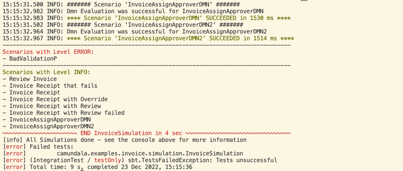
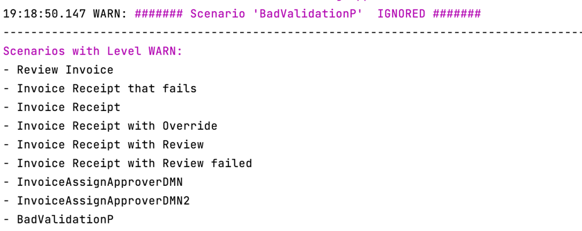
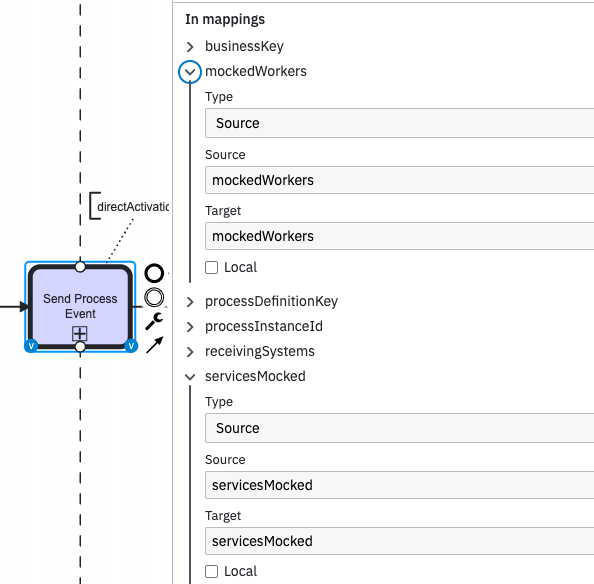
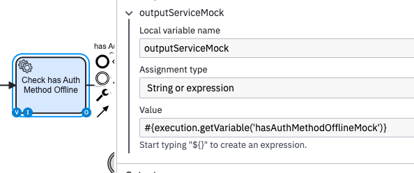

# Simulations

@:callout(warning)
This expects that your variables are simple values or JSON-objects/ -arrays.

For now this only works for **_Camunda 7_**.
@:@

Simulations let you run BPMNs and DMNs automatically on an installed Camunda 7 Platform.
The diagrams must be deployed.

@:callout(info)
For the deployment I created a script that also starts the Simulation.

See [deploy](../development/projectDev.md#deploy).
@:@

## Why

I like Simulations because:

- If there are problems, you easily can check the Camunda Cockpit.
- I think they are easy to maintain.
- The in- and outputs are exactly the API of the BPMNs.
- You can move to every part of your BPMN automatically,
  for example to check a _UserTask_.
- It is great to develop test driven.
- With the heat map, you can check, if you tested already all paths.

Of course most of these points are also true for Unit- and/or Scenario tests.

@:callout(info)
I also experimented with Unit- and Scenario Tests, and it would also be possible. But for now I concentrate
my time on Simulations. I also think you should only do one of them, due to the work involved.
@:@

## Get Started

Simulations use the BPMNs you created - in this context I refer to the [Bpmn DSL](../bpmnDsl.md)

Let's start with a basic example:

```scala
// put your simulations in the simulation package of your project (it)
package orchescala.examples.invoice.simulation
// import the projects bpmns (Processes, UserTasks etc.)
import orchescala.examples.invoice.bpmn.*

// define a class that extends from a simulation DSL   
class InvoiceSimulation extends CompanySimulation:

  simulate(
    // add scenarios (comma separated)
    scenario(`Review Invoice`)(
      AssignReviewerUT,
      ReviewInvoiceUT
    ),
    scenario(InvoiceAssignApproverDMN),
    incidentScenario(
      `Invoice Receipt that fails`,
      "Could not archive invoice..."
    )(
      ApproveInvoiceUT,
      PrepareBankTransferUT
    ),
    // more scenarios  ..
  )
  end InvoiceSimulation
```

@:callout(info)
This class is automatically created with `./helper.scala process <processName>` - see [development > process](../development/projectDev.md#process).
@:@

#### simulate

This is the entry point for your Simulation.
There is one Simulation per Simulation class (file).
A Simulation contains one or more Scenarios.

#### scenario

A scenario consists of a BPMN process or a DMN decision.
Then in optional second brackets you can add steps that interact
with the process. For DMNs there won't be any.

### Run the Simulation

In your _sbt-console_:

- run all simulations:

  `simulation/test`

- run some simulations:

  `simulation/testOnly *MySimulation`

  You can use any pattern, where `*` is wildcard for any characters.

This creates the following output:

...


#### Log Levels Colors

Depending on the log level, the most important delimiters are in color:

- **Error: Red**
- **Warning: Magenta**
- **Info: Green**

#### Simulation succeed / failure

As soon as there is a log entry with the level ERROR, the Simulations fail and the failing
Simulations are listed.

#### Reference to Camunda Cockpit

Each Process Scenario will print a link to the according Process-Instance:

`15:15:32.926 INFO: Process 'example-invoice-c7-review' started (check http://localhost:8034/camunda/app/cockpit/default/#/process-instance/42f84722-82cc-11ed-b5c6-9e5abd655523)`

This is not available for a DMN Scenario.

## Simulation

### Naming

The DSL is using the names of your BPMN objects like Processes and UserTasks.
As these objects can be reused in different Scenarios and Steps, we take the name
of the variable.

```scala
  lazy val `Invoice Receipt with Review` =
  `Invoice Receipt`
    .withOut(InvoiceReceiptCheck(clarified = Some(true)))
lazy val NotApproveInvoiceUT =
  ApproveInvoiceUT
    .withOut(ApproveInvoice(false))
.
..
scenario(`Invoice Receipt with Review`)(
  NotApproveInvoiceUT,
  subProcess(`Review Invoice`)(
    AssignReviewerUT,
    ReviewInvoiceUT // do clarify
  ),
  ApproveInvoiceUT, // now approve
  PrepareBankTransferUT
)
...
```

In this example we have a ProcessScenario with the name _Invoice Receipt with Review_.
The first Step has the name _NotApproveInvoiceUT_.

@:callout(info)
Use descriptive variable names.
If you use special characters, you need to use backticks, like:

```scala
lazy val `Invoice Receipt with Review` =
...
```

@:@

These names are then used in the output Log:


### Configuration

The configuration is described in [03-simulation].

You can easily override it in your Simulation:

```scala
override implicit def config =
  super.config
    .withLogLevel(LogLevel.DEBUG)
    .withMaxCount(20)
```

Especially interesting on the level of each Simulation are:
- `logLevel` to debug the Simulation.
- `maxCount` to increase the timeout for the interactions (one count is one second).

## Scenarios

The following chapters explain the different scenario types:

### Process Scenarios

#### scenario

An end to end simulation of one process path.

```scala
...
scenario(PROCESS)
scenario(PROCESS)(
  INTERACTIONS
)
...
```

- PROCESS: The Process you defined with the [BPMN DSL].
- INTERACTIONS: Whenever the Path of the Process comes to an Activity that interacts
  with the outside world ([User Task], [Receive Message Event] or [Receive Signal Event]),
  you add an according Process Step - see [Steps].
  This is **optional**, you can skip it if your process has no interactions.

Example:

```scala
...
scenario(`Invoice Receipt with Review`)(
  NotApproveInvoiceUT,
  subProcess(`Review Invoice`)(
    AssignReviewerUT,
    ReviewInvoiceUT // do clarify
  ),
  ApproveInvoiceUT, // now approve
  PrepareBankTransferUT
)
...
```

#### incidentScenario

To simulate a process that stops due an incident needs a special treatment
as it never finishes.

```scala
...
incidentScenario(
  PROCESS,
  INCIDENT_MESSAGE
)
incidentScenario(
  PROCESS,
  INCIDENT_MESSAGE
)(
  INTERACTIONS
)
...
```

Additional to the scenario we need to define:

- INCIDENT_MESSAGE: This is the incident message or a part of it.

Example:

```scala
...
incidentScenario(
  `Invoice Receipt that fails`,
  "Could not archive invoice..."
)(
  ApproveInvoiceUT,
  PrepareBankTransferUT
)
...
```

#### badScenario

Yet another case is if the process never gets started.
For example you validate the input variables and they fail.
In this case Camunda throws an Error.
To handle this we need to do the following:

```scala
...
badScenario(
  PROCESS,
  HTTP_STATUS,
  ERROR_MESSAGE
)
...
```

- HTTP_STATUS: The status of the REST response.
- ERROR_MESSAGE: Optional you can define the message or part of it, that the body must contain.

Example:

```scala
...
badScenario(
  BadValidationP,
  500,
  "Validation Error: Input is not valid: DecodingFailure(Missing required field, List(DownField(creditor)))"
)
...
```

### DMN Scenario

_Orchescala_ uses
the [Evaluate Decision REST API](https://docs.camunda.org/manual/7.18/reference/rest/decision-definition/post-evaluate/)
from _Camunda_.

```scala
simulate(
  scenario(InvoiceAssignApproverDMN)
)
// OR
simulate(
  InvoiceAssignApproverDMN // scenario is created automatically
)
```

As this is a single request, all you need is to add your DMN description you did with the BPMN DSL.

See [Business Rule Tasks (Decision DMNs)]

The simulation does the following steps:

- Take the attributes from your input
- Call the evaluation service
- Validate the result with your output

**The Example:**

We have the following DMN definition (bpmn):

```scala
lazy val InvoiceAssignApproverDMN = collectEntries(
  decisionDefinitionKey = "example-invoice-c7-assignApprover",
  in = SelectApproverGroup(),
  out = Seq(ApproverGroup.management),
  descr = "Decision Table on who must approve the Invoice.",
)
```

This uses the following Inputs and outputs (domain):

```scala
case class SelectApproverGroup(
                                amount: Double = 30.0,
                                invoiceCategory: InvoiceCategory =
                                InvoiceCategory.`Software License Costs`
                              )

@description("These Groups can approve the invoice.")
enum ApproverGroup:
case accounting
, sales
, management
```

- Running this will use the inputs `amount` and `invoiceCategory` for the evaluation.
- The result, a list of `ApproverGroup`s (_collectEntries_), will then be matched against our specified `ApproverGroup`
  s.

@:callout(info)
At time of writing, there is no replacement in **_Camunda 8_** for this.
@:@

### Start Scenario with message

It is also possible to send a message to a process with a _Start Message Event_.

```scala
...
scenario(PROCESS.startWithMsg)
scenario(PROCESS.startWithMsg)(
  INTERACTIONS
)
...
```

All that is needed is to postfix the process with `.startWithMsg`.

### Ignore a Scenario

You can ignore a scenario by just prefix your Scenario with `ignore`.

#### Examples:

```scala
simulate(
  ignore.scenario(`Review Invoice`)(
    AssignReviewerUT,
    ReviewInvoiceUT
  ),
  ignore.incidentScenario(
    `Invoice Receipt that fails`,
    "Could not archive invoice..."
  )(
    ApproveInvoiceUT,
    PrepareBankTransferUT
  ),
  ignore.scenario(InvoiceAssignApproverDMN),
  ignore.badScenario(
    BadValidationP,
    500,
    "Validation Error: Input is not valid: DecodingFailure(Missing required field, List(DownField(creditor)))"
  ),
)
```

An ignored Scenario will create a Warning in the output Log, like this:



### Ignore all Scenarios

If you want to ignore all the Scenarios you can 'ignore' the Simulation like:

```scala
  ignore.simulate(
  scenario(.
..),
scenario(
...),
)
```

### Only a Scenario

You can run only one are a few scenario at the time by just prefix your Scenarios with `only`.

#### Examples:

```scala
simulate(
  scenario(`Review Invoice`)(
    AssignReviewerUT,
    ReviewInvoiceUT
  ),
  only.incidentScenario(
    `Invoice Receipt that fails`,
    "Could not archive invoice..."
  )(
    ApproveInvoiceUT,
    PrepareBankTransferUT
  ),
  only.scenario(InvoiceAssignApproverDMN)
)
```

An only Scenario will create a Warning for all other Scenarios as they are ignored.

## Steps

This is a List with Process Interactions like [User Task], [Receive Message Event] or [Receive Signal Event].
Each Interaction is simply the Activity you define with the [BPMN DSL].

```scala
...
scenario(PROCESS)(
  STEP1,
  STEP2,
...
)
...
```

See example in [Process Scenarios].

### Sub Process (Call Activity)

A special case are sub processes. If your process contains sub processes, there are
the following possibilities:

- The sub process has no interactions:
    - Nothing to do.
- The sub process contains interactions, but is mocked (returns a defined result, skipping the interactions):
    - Nothing to do.
- The sub process contains interactions:
    - You can add a subProcess to your simulation, like:
  ```scala
   ...
  subProcess(`Review Invoice`)(
    AssignReviewerUT,
    ReviewInvoiceUT // do clarify
  ),
  ... 
  ```
  This will change the context to the sub process and in the end switch it back to
  the main process.

@:callout(info)
This only works for one hierarchy of sub processes.
When you have more complex sub processes, you must mock them.

**Not recommended**: please test each process separately.
@:@

## Validation

The simulation uses your BPMN DSL objects not just to run the process and its interactions.
It also uses the input- and output domain objects to validate variables of the process.

```scala
// domain classes
case class In(
 creditor: String = "Great Pizza for Everyone Inc.",
 amount: Double = 300.0,
//...
)
case class Out(
 approved: Boolean = true,
 //...
)
//...
// bpmn object
process(
  in = InvoiceReceipt(),
  out = InvoiceReviewed()
)
```

- in: The input of a BPMN object.
- out: The output of a BPMN object.

Each attribute of the in/out-objects represents a variable on the process.

The exact usage of the BPMN DSL objects differ slightly:

**Process**

- in: Each attribute is an input variable to start the process.
- out: When process is finished it **validates** if these attributes match the according
  variables in the process.

**User Task**

- in: When the process is at the User Task, it **validates** if these attributes match the according
  variables in the process.
- out: Each attribute is a variable to complete the User Task.

**Receive Message Event**

- in: Each attribute is a variable to send a message to start or proceed the process.

**Receive Signal Event**

- in: Each attribute is a variable to send a signal to start or proceed the process.

### Test Overrides

There may be lots of variables to test or you first just want to develop the process.
In this case you can override the validation with the domain objects.

```scala
...
scenario(WithOverrideScenario)(
  `ApproveInvoiceUT with Override`,
  PrepareBankTransferUT
)
...
private lazy val WithOverrideScenario =
  `Invoice Receipt with Override`
    .exists("approved")
    .notExists("clarified")
    .isEquals("approved", true)

private lazy val `ApproveInvoiceUT with Override` =
  ApproveInvoiceUT
    .exists("amount")
    .notExists("amounts")
    .isEquals("amount", 300.0)
```

As you see in this example, you can simply add checks.
Now only these checks are run by the validation.

The following overrides are provided (for now):

#### exists

```scala
  .exists(VARIABLE_NAME)
```

A variable with this `VARIABLE_NAME` must exists.

#### notExists

```scala
  .notExists(VARIABLE_NAME)
```

A variable with this `VARIABLE_NAME` must not exists.

#### isEquals

```scala
  .isEquals(VARIABLE_NAME, VARIABLE_VALUE)
```

A variable with this `VARIABLE_NAME` must have the value `VARIABLE_VALUE`.

#### hasSize

For collections:

```scala
  .hasSize(VARIABLE_NAME, VARIABLE_VALUE_SIZE)
```

A variable with this `VARIABLE_NAME` must be a collection with the size `VARIABLE_VALUE_SIZE`.

For DMN ResultList and CollectEntries:

```scala
  .hasSize(VARIABLE_VALUE_SIZE)
```

A DMNs result must be a collection with the size `VARIABLE_VALUE_SIZE`.

#### contains

For collections:

```scala
  .contains(VARIABLE_NAME, VARIABLE_VALUE)
```

A variable with this `VARIABLE_NAME` must be a collection and one of its values must have the `VARIABLE_VALUE`.

For DMN ResultList and CollectEntries:

```scala
  .contains(VARIABLE_VALUE)
```

A DMNs result must be a collection and one of its values must have the `VARIABLE_VALUE`.

### Read the Results

During execution and checking the results some of the results are printed on the console.
The most important stuff is then gathered during the Simulation and printed grouped by the Simulation and Scenario.

@:callout(info)
The reason that there are some logs during execution, is that we used Gatling earlier.
So the core still is not migrated to the new Simulation, that gathers all the logs and prints it nicely at the end.
@:@

#### Simulations Overview

@:image(images/simulation_simulationsOverview.png) {
intrinsicWidth = 800
style = logo
}

- First you see all Scenarios grouped by its LogLevel.
- Failed Simulations are listed at the end.

@:callout(info)
If you run more than one Simulation (`sbt It/test`), each Simulation is printed with the Scenario overview.
At the end all Simulation that failed are listed.
@:@

#### Scenarios Overview

@:image(images/simulation_scenariosOverview.png) {
intrinsicWidth = 800
style = logo
}

- Each Scenario is started with a marker in the color of its log level.
- According to the configured Log Level all messages are printed.
- You have a link to the process in the Camunda Cockpit.
- If the Validation failed, you need to look for `!!!` in the above log. **See the next chapters.**
- It ends with a marker that shows the time the Scenario took.

#### Result is different

The expected value does not match the value of the process.

Example:

```shell
!!! The expected value 'CString(hello,String)' of someOut does not match the result variable 'CString(other,String)'.
 List(CamundaProperty(.., CamundaProperty(simpleEnum,CString(One,String)), CamundaProperty(someValue,CString(hello,String)), ...))
```

> It always lists all Variables of the Process below the message.

#### Result is missing

This is for optional variables, where you expect a value, but in the process there is no such variable.

Example:

```shell
!!! The expected value 'CString(hello,String)' of someOut does not match the result variable 'CNull'.
 List(CamundaProperty(.., CamundaProperty(simpleEnum,CString(One,String)), CamundaProperty(someValue,CString(hello,String)), ...))
```

#### Result is not expected

This is for optional variables you have set to `None`, but in the process such a variable exists.

Example:

```shell
!!! The expected value 'CNull' of someOut does not match the result variable 'CString(hello,String)'.
 List(CamundaProperty(.., CamundaProperty(simpleEnum,CString(One,String)), CamundaProperty(someValue,CString(hello,String)), ...))
```

## Timing

The interactions with a process are time relevant.
For example you only can interact with a User Task if the process is actually at that User Task.

For this we check every second if the process is ready.
The time on how long it should check can be configured. See `maxCount` in [Configuration].
Whenever this timeout is reached, it throws an exception and the scenario has failed.

Here an example output:


Depending on the interaction, we have the following strategies:

#### Process

To check the variables of a process, the process must be finished.
It checks if the state of the process is `COMPLETED`.

#### User Task

It simple tries until there is a User Task in the process available.
If there are more than one, it just takes the first one.

To complete a User Task, you can also wait some seconds. 
This is useful, if you want to check if intermediate events were triggered.
```scala
scenario(userTaskExampleProcess)(
  userTaskExample
    .waitForSec(2) // wait 2 seconds
)
```

#### Receive Message Event

We try to correlate the message until it is successful.
This works as Camunda tries to correlate a message to exactly one
_Receive Message Event_ (we use the `processInstanceId`).

#### Receive Signal Event

The way of Correlate Messages does not work for Signals, as they are
_fire and forget_.
So you need to add an attribute with a certain value, we can check.

```scala
scenario(signalExampleProcess)(
  signalExample
    .waitFor("signalReady", true),
)
```

Just add the postfix `.waitFor(WAITFOR_VARIABLE_NAME, WAITFOR_VARIABLE_VALUE)` to the BPMN Signal definition.
In your process you must now set this variable with the according value, when the process is at this event.

@:callout(info)
This is also possible for _Receive Message Event_.
If you do not define it for _Receive Signal Event_ it takes the default
value `waitForSignal` and checks if it is `true`.
@:@

#### Timer Event

You can execute an intermediate timer event immediately.

```scala
scenario(timerExampleProcess)(
  timerExample
    .waitFor("timerReady", true),
)
```

### Concrete wait time

If you have a use case that is easier to just wait a bit (not recommended;), you can just add this step

```scala
scenario(signalExampleProcess)(
  waitFor(2),
  nextUserTask,
)
```

This will wait for 2 seconds.

## Mocking

@:callout(info)
Mocking is handled directly in the processes itself.

This is especially useful in _Simulations_.

However, you can mock on any environment, like local or production (e.g. with _Postman_).

See also [General Concerns](../generalConcerns.md#mocking).
@:@

### Generic Mocking

Running a Process you have 2 possibilities to mock _ServiceTasks, CustomTasks, Sub Processes (Call Activities)_ in a
generic way:

- `servicesMocked`:
    - Mocks all _ServiceTasks_ in a _Process_.

    - This is a flag you can set to `true`, `false` is the default.
      - Example:
        ```scala
        example
          .mockServices
        ```

  - `mockedWorkers`:
      - Mocks all specified _Sub Processes_ and _Workers_ in a _Process_.
      - This is a list of _processNames_ and/or _topicNames_ you want to mock.
      - Example:
        ```scala
        example
          .mockWorkers(ModuleGlobal.processName, MyWorker.topicName)
        ```
    
For both you need to add an in-mapping in case of a _Sub Process_ (_CallActivity_).


### Provide default Mocks

#### Process or CustomWorker

In your _Process_ or _CustomWorker_ you define automatically a default Mock, with

```scala
lazy val example = process(
  In(),
  Out()
)
```

This is static and will always return `Out()`.

You can also define a dynamic Mock, that depends on the input:

```scala
lazy val example = process(
  In(),
  Out.DoIt()
).mockWith: in =>
   if in.doIt then Out.DoIt() else Out.DontDoIt() 
```

Here you can create the Mock depending on the input.

#### Service Worker

Analog to _Process_ or _CustomWorker_ you define automatically a default Mock for _ServiceWorker_, with

```scala
lazy val example = serviceTask(
  In(),
  Out(),
  serviceMock,
  serviceInExample
)
```

This is static and will always return `serviceMock.toServiceResponse`.

You can also define a dynamic Mock, that depends on the input:

```scala
lazy val example = serviceTask(
  In(),
  Out(),
  serviceMock,
  serviceInExample
).mockWith: in =>
    MockedServiceResponse.success200(Out(
      if in.value == 1 then true else false
    ))
```

Here you can create the _MockedServiceResponse_ depending on the input.

### Specific Mocking in the Process

It is also possible to define a concrete Mock for a step in the process (Sub Process, Worker).

#### SubProcess or Worker

You can define the `outputMock` for any _SubProcess_ or _Worker_ in your `InConfig` class.

```scala
case class InConfig(
    ...
    @description(serviceOrProcessMockDescr(GetPoa.Out()))
    getPoasMock: Option[GetPoa.Out] = None,
    @description(serviceOrProcessMockDescr(GetPoaPoaKey.Out()))
    getPoaDetailMock: Option[GetPoaPoaKey.Out] = None,
    @description(serviceOrProcessMockDescr(GetClientClientKey.Out.privateIndividual()))
    getPoaPersonMock: Option[GetClientClientKey.Out] = None
)
```

As you see, you just define the `Out` type of that service.

To provide a nice description, just use `@description(serviceOrProcessMockDescr(MyService.Out()))`.

In your Simulation you can then use this Mock:

```scala
example
  .withIn(
      In(
        inConfig =
          Some(InConfig(
            getPoaPersonMock = Some(GetClientClientKey.Out(
              ...
            )),
          ))
   ))
```
#### ServiceWorker

Additionally, to `outputMock`, you can define `outputServiceMock` for any _ServiceWorker_ in your `InConfig` class.

```scala
case class InConfig(
  ...
  @description(serviceOrProcessMockDescr(GetUserToken.serviceMock))
  hasAuthMethodOfflineMock: Option[MockedServiceResponse[GetUserToken.ServiceOut]] = None
)
```
As you see, you just define the `ServiceOut` type of that service wrapped in a `MockedServiceResponse`.

To provide a nice description, just use `@description(serviceOrProcessMockDescr(MyService.serviceMock))`.

In your Simulation you can then use this Mock:

```scala
example
  .withIn(
      In(
        inConfig =
          Some(InConfig(
            hasAuthMethodOfflineMock = Some(
              MockedServiceResponse.success200(ServiceOut(
                UserTokenData(..)
              ))
          ))
      ))
)
```

With `outputMock` and `outputServiceMock`, you need an according mapping in the BPMN.



### Priorities / Order
There is a defined priority on how the Mocks are applied (from top).

- outputServiceMock (Service Worker only)
- outputMock
- mockedWorkers
- servicesMocked (Service Worker only)

So in general you can override a generic Mock with a specific Mock.

## Load Testing

@:callout(info)
At the moment this is not supported.

As the simulations are run in parallel, you can add more scenarios to increase the load.
@:@
