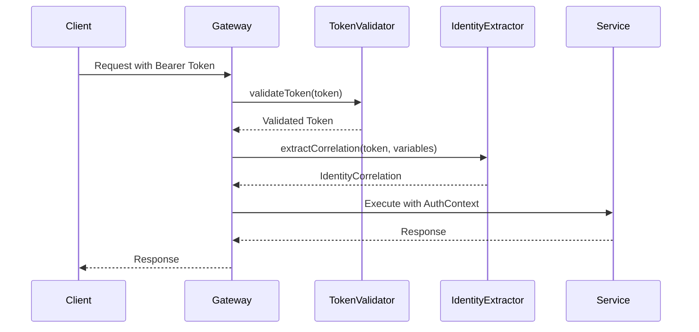

# Authentication

The Gateway uses Bearer token authentication to secure all API endpoints. This page explains how authentication works and how to customize it.

## Overview

Every request to the Gateway must include a Bearer token in the `Authorization` header:

```
Authorization: Bearer <your-token>
```

The Gateway performs two main authentication operations:

1. **Token Validation** - Validates that the token is legitimate
2. **Identity Correlation Extraction** - Extracts user identity information from the token

## Authentication Flow



## GatewayConfig Authentication Methods

The `GatewayConfig` trait defines two authentication methods:

### validateToken

```scala
def validateToken(token: String): IO[GatewayError, String]
```

Validates the Bearer token and returns the validated token string. This method is called for **every** request.

### extractCorrelation

```scala
def extractCorrelation(
  token: String, 
  in: JsonObject
): IO[GatewayError, IdentityCorrelation]
```

Extracts identity correlation information from the token and input variables. This is used for:
- Starting new processes (to sign the identity correlation)
- Completing user tasks (to track who completed the task)

The `IdentityCorrelation` contains:
- `username` - The user's username
- `email` - The user's email address
- `impersonateProcessValue` - Optional impersonation value
- `issuedAt` - When the token was issued
- `processInstanceId` - The process instance ID (set later)
- `signature` - Cryptographic signature for security

## Default Implementation

The `DefaultGatewayConfig` provides a JWT-based implementation:

```scala mdoc
import orchescala.gateway.{DefaultGatewayConfig, GatewayConfig}
import orchescala.engine.DefaultEngineConfig
import orchescala.worker.DefaultWorkerConfig

val config = DefaultGatewayConfig(
  engineConfig = DefaultEngineConfig(),
  workerConfig = DefaultWorkerConfig(DefaultEngineConfig()),
  gatewayPort = 8080
)
```

### Token Validation

The default implementation performs a simple non-empty check:

```scala
override def validateToken(token: String): IO[GatewayError, String] =
  if token.trim.nonEmpty then
    ZIO.succeed(token)
  else
    ZIO.fail(GatewayError.TokenValidationError("Token is empty"))
```

### JWT-Based Identity Extraction

The default implementation uses the auth0 JWT library to extract claims:

```scala
override def extractCorrelation(
  token: String, 
  in: JsonObject
): IO[GatewayError, IdentityCorrelation] =
  // Decodes JWT and extracts:
  // - preferred_username
  // - email
  // - impersonation value from input variables (if configured)
```

## AuthContext: Token Pass-Through

The Gateway uses a fiber-local context pattern to pass Bearer tokens from HTTP requests down to Camunda API calls without modifying service method signatures.

### How It Works

```scala
// In route handlers
AuthContext.withBearerToken(validatedToken):
  // All service calls within this scope have access to the token
  processInstanceService.startProcessAsync(...)
```

The `AuthContext` is a ZIO FiberRef that stores the Bearer token for the duration of the request. This allows:
- Clean service method signatures (no token parameter needed)
- Automatic token propagation to Camunda API calls
- Thread-safe token isolation per request

### Example from ProcessInstanceRoutes

```scala
val startProcessEndpoint =
  ProcessInstanceEndpoints.startProcessAsync
    .zServerSecurityLogic: token =>
      config.validateToken(token)
    .serverLogic: validatedToken =>
      (processDefId, businessKey, tenantId, variables) =>
        // Extract identity correlation
        config.extractCorrelation(validatedToken, variables)
          .flatMap: correlation =>
            // Set bearer token in AuthContext
            AuthContext.withBearerToken(validatedToken):
              // Token is now available to all downstream calls
              processInstanceService.startProcessAsync(...)
```

## Custom Authentication

You can implement custom authentication by overriding the `GatewayConfig` methods:

```scala mdoc
import orchescala.gateway.*
import orchescala.engine.*
import orchescala.worker.*
import orchescala.domain.*
import zio.ZIO

class CustomGatewayConfig extends GatewayConfig {

  override val engineConfig: EngineConfig = DefaultEngineConfig()
  override val workerConfig: WorkerConfig = DefaultWorkerConfig(DefaultEngineConfig())
  override val gatewayPort: Int = 8080

  override def validateToken(token: String): IO[GatewayError, String] =
    // Custom validation logic (e.g., call external auth service)
    if token.startsWith("valid-") then
      ZIO.succeed(token)
    else
      ZIO.fail(GatewayError.TokenExtractionError("Invalid token"))

  override def extractCorrelation(
                                   token: String,
                                   in: JsonObject
                                 ): IO[GatewayError, IdentityCorrelation] =
    // Custom identity extraction logic
    ZIO.succeed(IdentityCorrelation(
      username = "custom-user",
      email = Some("user@example.com"),
      impersonateProcessValue = None,
      issuedAt = System.currentTimeMillis(),
      processInstanceId = Some("customerId"),
    ))
}
```

## Security Considerations

1. **Token Validation**: Always implement proper token validation in production
2. **HTTPS**: Use HTTPS in production to protect tokens in transit
3. **Token Expiration**: Implement token expiration checks
4. **Identity Correlation**: The signature ensures process identity cannot be tampered with
5. **Impersonation**: Use the `impersonateProcessValue` carefully and only when needed

## See Also

- [Impersonation](03-impersonation.md) - Details on identity correlation and process security

