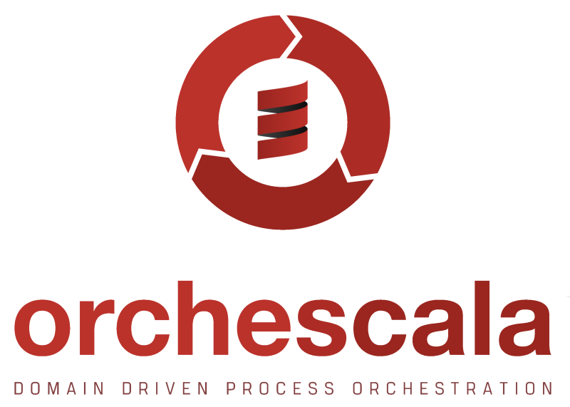

## Description
See [Documentation](https://pme123.github.io/orchescala/)

For details on Bearer token authentication, see the [Gateway README](06-gateway/README.md#authentication).

# Development

## Update Dependencies

Use https://github.com/kitlangton/given

## Releasing
Just run `./helper.scala VERSION`.

## Local publish

`sbt publishLocal`

## Documentation
We use [mdoc](https://scalameta.org/mdoc/) to verify the documentation
and [laika](https://typelevel.org/Laika/) to generate the htmls.

Run mdoc:   `sbt "docs/mdoc --watch"`
And laika:  `sbt "~docs/laikaPreview"`
Check the result in http://localhost:4242

## License
This project is licensed under the MIT License - see the [LICENSE](LICENSE) file for details.